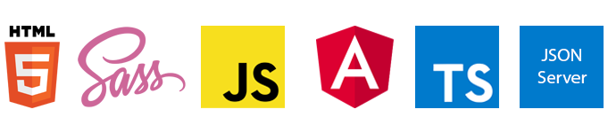

# Desafio Front End [Dotz]

Este projeto foi gerado com as seguintes tecnologias.



Aplicação web que aborda o "Programa de Fidelidade Dotz".

O projeto consiste em realizar um auto cadastro para que o mesmo possa ter acesso a aplicação e assim poder realizar o login com os dados fornecidos, uma vez logado o usuário poderá ter acesso aos pedidos resgatados e realizar novos resgates.

Estou aberto a sugestões e melhorias.

## Pré requisitos

- Instalar [NodeJS](https://nodejs.org/en/)
- Instalar [Angular](https://angular.io/guide/setup-local)
- Instalar [JSON Server](https://www.linkedin.com/pulse/apis-fakes-com-json-server-ivan-villacorta/) - o link encaminha para um artigo que escrevi explicando um pouco mais da instalação e como podemos usar o JSON Server.

## Executando o projeto

### - Instalando as dependências

Após clonar o projeto é preciso instalar as dependências, o projeto final esta na branch 'main', use o seguinte comando para instalar as dependências:
```
npm i
```
### - Executando as API's

As API`s foram criadas usando JSON Server e devem ser executadas durante todo o processo em que a aplicação estiver rodando.
Para isso abra o projeto no terminal de sua preferência e rode o seguinte comando:
```
json-server --watch db.json
```

### - Executando o front end

Para rodar a aplicação use o seguinte comando:
```
ng serve
```

Feito isso navegue para http://localhost:4200


Pronto, a aplicação vai estar rodando, faça seu cadastro para conferir o programa de fidelidade Dotz, espero ter alcançado o objeto do desafio, vou ficar feliz em receber o feedback, até mais.